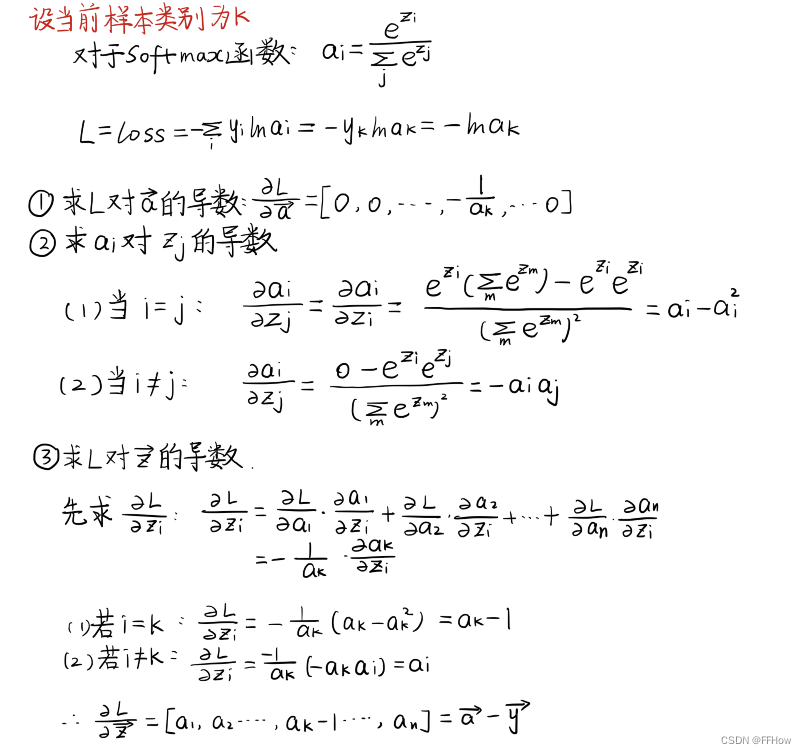

### 1.优化算法 optimizer
    1.梯度下降
    1.1 全梯度下降，一次计算所有样本的梯度，计算量大，训练缓慢
    1.2 随机梯度下降，每次取一条样本计算梯度，容易陷入局部最优解
    1.3 mini-batch，每次取一个mini-batch计算梯度，取全部梯度的平均值，多次计算更新一次参数，梯度方向对mini-batch数据敏感，容易震荡
    1.4 Momentum，一般与SGD同用，模拟物体运动惯性，保存过去的一部分梯度方向信息，训练更快
        v = beta * v + (1-beta) * g
        w = w - lr * v

    1.5 Adagrad，在学习率上加一个约束
        Gt = Gt + g**2
        w = w - lr/(math.sqrt(Gt) + θ) * g

    1.6 Rmsprop，约束为：学习率除梯度的均方根
        Gt = beta * Gt + (1 - beta) * g**2
        w = w - lr / (math.sqrt(Gt) + θ) * g

    1.7 Adam， 综合了Momentum和Adagrad
        Vt = beta1 * Vt + (1 - beta1) * g 
        Gt = beta2 * Gt + (1 - beta2) * g**2
        Vt_1 = Vt / (1-beta1)
        Gt_1 = Gt / (1-beta2)
        w = w - lr / (math.sqrt(Gt_1) + θ) * Vt_1

    1.8 Adamw，原来的adam + L2正则，是损失上加模型参数的L2范数，求导后，梯度g多了一个lamada * w，现在把这个求导后的正则项直接加在更新参数的阶段。
        Vt = beta1 * Vt + (1 - beta1) * g 
        Gt = beta2 * Gt + (1 - beta2) * g**2
        Vt_1 = Vt / (1-beta1)
        Gt_1 = Gt / (1-beta2)
        w = w - lr / (math.sqrt(Gt_1) + θ) *  (Vt_1 + lamada * w)
    
    2.牛顿法
    利用参数的二阶导数，下降更快，计算量更大；梯度下降是用一个平面去拟合梯度，牛顿法是用一个二阶曲面去拟合

    3.拟牛顿法

    4.共轭梯度算法

### 2.为什么线性层Wx+b需要有偏置b？
    当我们的输入并不是0均值，且没有做标准化时候，是需要B来补偿的，可以增加模型的拟合能力的。
    有标准化层后，B可有可无。

### 3.为什么softmax和交叉熵一起使用？

结合后一起求导，等于  softmax后的向量 - label的onehot向量，导函数计算量少。

### 4.softmax在进行计算前需要减去最大值
    当需要计算的列表里面有一个很大的数时候，e的x次方会溢出，因此需要减去最大值再计算。

