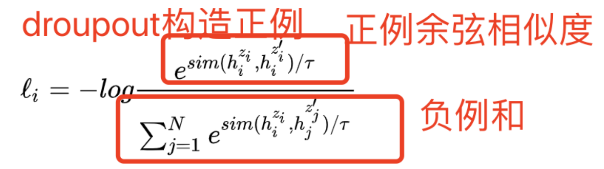

### 1.Simcse和SBert的概念及差异
目的：bert用作文本向量表示时候，存在的坍缩现象（所有文本的相似度拉不开差距），为了拉近相似样本的距离，增加不相似样本的距离

区别：
Simcse采用对比学习的方式，正样本是同样的文本经过两次不同的dropout产生，在无监督中，负样本通过同一batch随机选取。损失函数是InfoNceloss的基础上加入温度系数

Sbert使用两个句子的输出（U，V，U-V）拼接一个全连接层，经过softmax后用交叉熵。（因为我们已经人工定义了两两样本的相似度的数值）

在项目中，先用无监督训练Simcse，再进行Sbert的有监督训练。